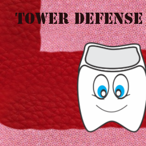
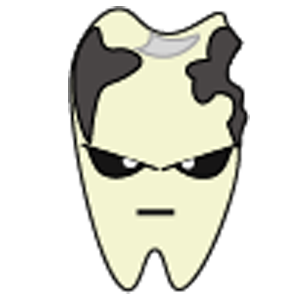

# Bem-vindo ao meu Portfólio
* * * 

# QUEM SOU EU?

_Meu nome é Caio Matheus, aluno do Curso Integrado de Programação de Jogos Digitais, do IFRN Campus Ceará-mirim. Futuramente, pretendo cursar Biologia Marinha ou Medicina Veterinária na Universidade Federal do Rio Grande do Norte (UFRN)._

* * *

# Empresas que já atuei

* * *

# Jogos desenvolvidos na Empresa Poçomar

### Elements

### Fuga das Vacas
  

### Tower Defense

* * * 

# Artes que desenvolvi para alguns Jogos

### Arte do Jogo Tower Defense  

  

  

  

  

  

### Arte do Jogo Elements

  

  

* * * 

# Projetos 

* _Projeto de Extensão NUARTE, no IFRN Campus Ceará-mirim._  
* _Proj TCC: Jogos para crianças com TDAH (Transtorno de Déficit de Atenção e Hiperatividade)_ 

* * *

# Redes Sociais

* _Facebook: [Caio Matheus](https://www.facebook.com/fishtronauta)_    
* _Instagram: [caioogordo](https://www.instagram.com/caioogordo/)_    
* _E-mail: caiosouza.1999@hotmail.com_    

